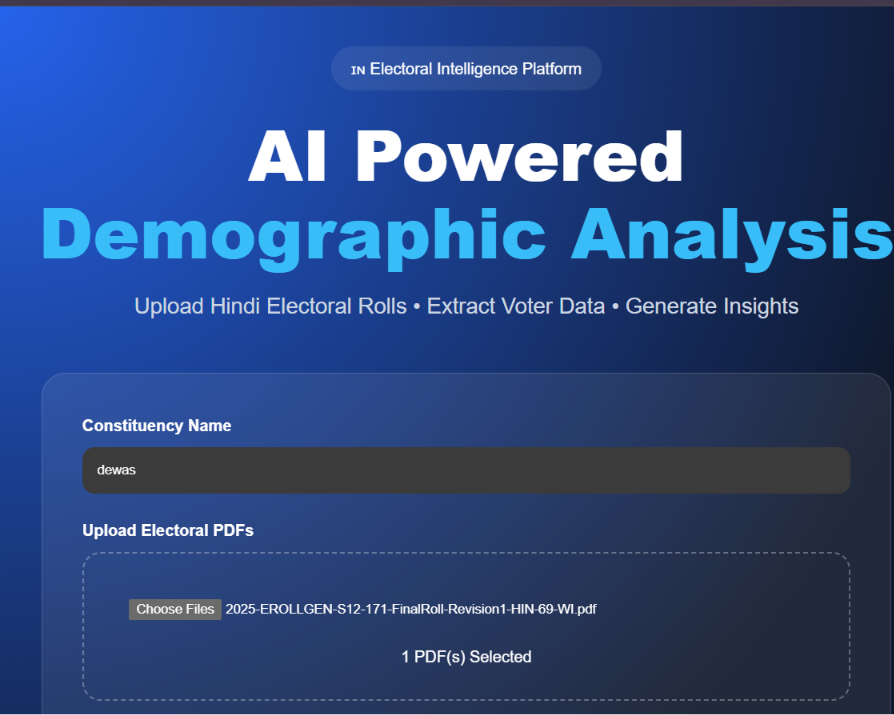
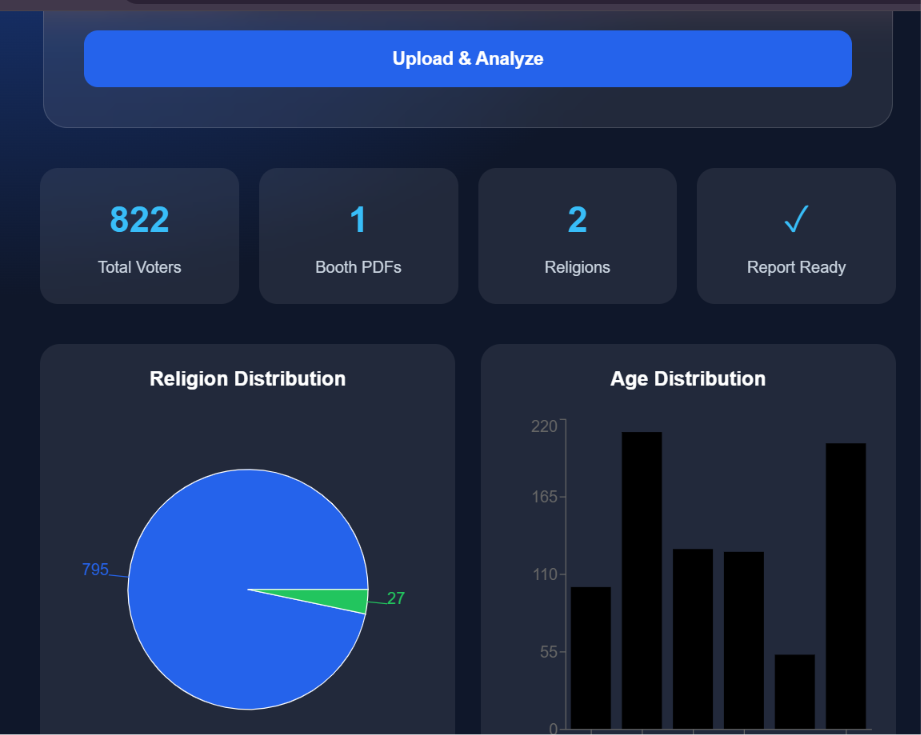

# 🇮🇳 Electoral Intelligence Platform

### AI-Powered Booth-Level Demographic Intelligence from Electoral Rolls

An end-to-end OCR and demographic analytics platform that transforms unstructured Hindi electoral roll PDFs into structured voter intelligence dashboards.

---

# Problem Statement

Electoral rolls in India are generally published as large PDF documents containing thousands of voter records.

Extracting meaningful demographic insights from these documents is difficult because:

* Data is unstructured
* Records are image-based
* Manual analysis is time consuming
* Booth-level demographic patterns remain hidden

As a result, administrators, researchers, political analysts and social scientists often spend significant effort cleaning and organizing data before analysis can begin.

This project automates that entire workflow.

---

# Solution

The Electoral Intelligence Platform automatically:

1. Reads Hindi Electoral Roll PDFs
2. Detects individual voter cards
3. Performs OCR using Tesseract
4. Extracts voter information
5. Classifies demographic attributes
6. Generates constituency-level analytics
7. Produces visual dashboards and reports

---

# Why Booth-Level Analysis Matters

Booths are the smallest operational unit in elections.

Understanding booth-wise demographics helps identify:

* Population concentration patterns
* Minority-majority distribution
* Age distribution trends
* Gender balance
* Youth voter density
* Senior citizen voter concentration
* Localized demographic clusters

Instead of analysing an entire constituency as one block, this system enables micro-level demographic understanding.

---

# Real-World Applications

## Election Research

Researchers can analyze demographic trends across booths and constituencies.

## Governance Planning

Administrators can identify areas with:

* High elderly population
* High youth concentration
* Gender imbalance
* Population density variations

## Social Development Studies

The extracted data can support:

* Welfare planning
* Public policy studies
* Demographic research
* Regional development assessment

## Data Digitization

Converts legacy electoral PDFs into structured datasets suitable for modern analytics workflows.

---

# System Workflow

Electoral Roll PDF
↓
PDF Processing
↓
Voter Card Detection
↓
OCR Extraction
↓
Information Parsing
↓
Religion Inference
↓
Demographic Analysis
↓
Interactive Dashboard

---

# Key Features

### OCR Pipeline

* Hindi OCR
* English OCR
* Automated Card Detection
* Large PDF Processing

### Demographic Analytics

* Religion Distribution
* Gender Distribution
* Age Group Distribution
* Constituency Summary
* Booth-Level Statistics

### Interactive Dashboard

* Real-Time Processing Timer
* Upload Monitoring
* Analytics Cards
* Visual Charts
* Downloadable Reports

---

# Technology Stack

## Backend

* Python
* Flask
* Pandas
* OpenCV
* PyMuPDF
* Tesseract OCR

## Frontend

* React
* Vite
* Axios
* Recharts

---

# Screenshots

## Dashboard

## Processing Workflow

## Demographic Analytics

---

# Project Architecture

React Frontend
↓
Flask API
↓
OCR Engine
↓
Data Extraction Layer
↓
Demographic Analysis Layer
↓
Visualization Dashboard

---

# Future Enhancements

* GIS-Based Booth Mapping
* Interactive Constituency Maps
* PDF Report Generation
* AI Generated Insights
* Multi-Constituency Comparison
* Historical Trend Analysis

---

# Author

Sourabh Gorkhe

Computer Science Engineer | Python Developer | Computer Vision & Data Analytics Enthusiast
